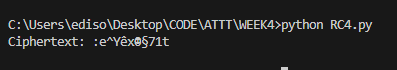
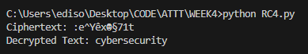

# Hệ mã RC4

## Thông tin cơ bản
Đầu vào: 
- Một đoạn văn bản cần mã hóa
- Một key được định dạng chuỗi

Đầu ra: 
- Một đoạn văn bản được mã hóa 

## Kết quả 
- Đầu vào: 
    - Text: "cybersecurity"
    - Key: "2501" 
- Đầu ra: 
    - Một đoạn văn bản mã hóa cho đầu vào
    
    - Kiểm tra lại xem khi giải mã có đúng không
    

## Cách chạy
```bash
python RC4.py
